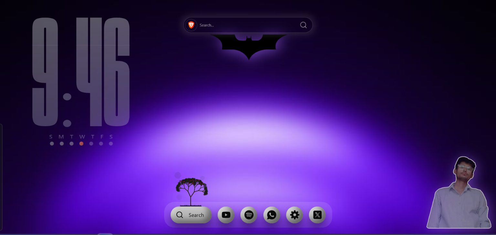
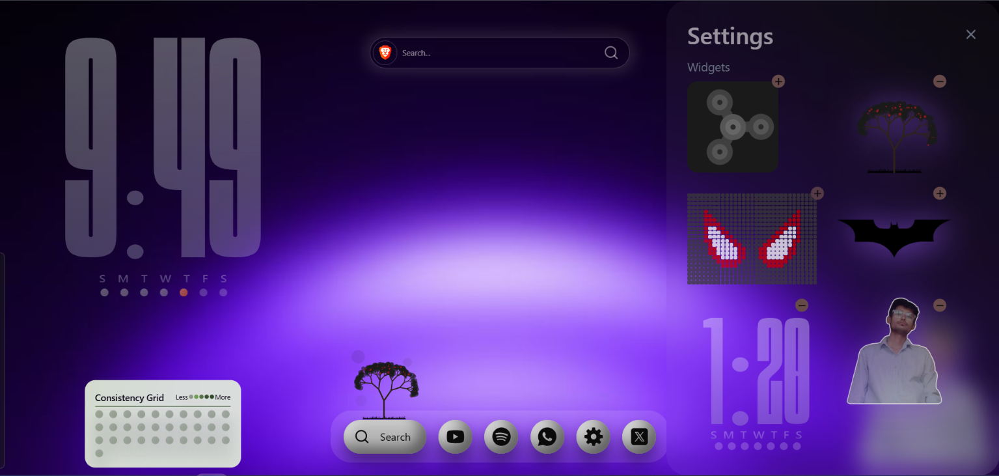

# New Tab --- Custom Browser Extension

A modern, highly customizable **New Tab browser extension** built with a
clean, immersive UI. Replace the default browser New Tab page with a
personalized workspace containing widgets, shortcuts, search, clock/date
displays, and visual elements.

## ✨ Features

- 🎨 **Custom New Tab Experience** --- Replace the default browser New
  Tab page with your own design.
- 🕒 **Clock & Date Widgets** --- Display time, date, and weekly
  indicators in a large visual layout.
- 🔎 **Search Bar** --- Quickly search the web directly from the New
  Tab page.
- 🚀 **Quick Shortcuts** --- Access frequently used websites/apps from
  the bottom dock.
- 🧩 **Customizable Widgets** --- Add, remove, and arrange widgets
  from the Settings panel.
- 🖼️ **Visual Widgets** --- Support for decorative and interactive
  widgets such as images, artwork, and pixel-style graphics.
- ⚙️ **Settings Panel** --- Manage which widgets appear on the New Tab
  page.
- 🌌 **Modern Visual Design** --- Dark purple/black background with
  glowing gradients, glassmorphism, and soft shadows.
<!-- - 📱 **Responsive UI** --- Designed to adapt to different screen
  sizes. -->
- 🧱 **Modular Architecture** --- Built so additional widgets and
  features can be added easily.

## 🖥️ Screenshots

### New Tab Page

<!--  -->


The main page provides a large clock, search bar, visual widgets, and a
bottom shortcut dock.

### Settings / Widget Manager


The Settings panel allows users to manage the widgets displayed on the
New Tab page.

## 🎨 UI / Design

The extension uses a dark, futuristic aesthetic built around:

- Deep black/purple backgrounds
- Purple ambient glow
- Glassmorphism
- Rounded cards and controls
- Large typography
- Soft shadows and highlights
- Minimal monochrome shortcut icons
- Animated/interactive widgets

The interface is intended to feel more like a personalized desktop
workspace than a traditional browser New Tab page.

## 🛠️ Tech Stack

- **React** --- UI component architecture
- **Vite** --- Development server and production build tooling
- **Tailwind CSS** --- Styling and responsive layouts
- **JavaScript** --- Application logic
- **Chrome/Chromium Extension APIs** --- New Tab override and browser
  integration

## 📦 Installation

### 1. Clone the repository

```bash
git clone <YOUR_REPOSITORY_URL>
cd <PROJECT_DIRECTORY>
```

### 2. Install dependencies

```bash
npm install
```

### 3. Start the development server

```bash
npm run dev
```

For extension development, build the project:

```bash
npm run build
```

This generates the production files in the configured build directory,
usually:

```text
dist/
```

## 🌐 Load the Extension in Chrome

1.  Open Chrome.
2.  Navigate to:

```text
chrome://extensions/
```

3.  Enable **Developer mode**.
4.  Click **Load unpacked**.
5.  Select the extension's generated `dist` directory.
6.  Open a new tab to see the custom New Tab page.

> The exact build directory may differ depending on your Vite
> configuration.

<!-- ## 📁 Suggested Project Structure

```text
new-tab-extension/
├── public/
├── src/
│   ├── components/
│   │   ├── Clock/
│   │   ├── Search/
│   │   ├── Dock/
│   │   ├── Settings/
│   │   └── Widgets/
│   ├── assets/
│   ├── App.jsx
│   └── main.jsx
├── screenshots/
│   ├── new-tab.png
│   └── settings.png
├── index.html
├── manifest.json
├── package.json
├── tailwind.config.js
└── vite.config.js -->
```

## ⚙️ Customization

The extension can be expanded with additional widgets and
personalization options, for example:

- Custom wallpapers
- Weather
- Calendar
- Notes
- To-do lists
- Music controls
- Battery information
- System information
- Bookmarks
- Search-engine selection
- Drag-and-drop widget positioning
- Widget visibility controls
- Custom themes
- Custom accent colors
- Background blur/intensity controls

## 🧩 Widget System

A useful approach is to treat every widget as an independent React
component.

For example:

```text
Widget
 ├── Clock
 ├── Calendar
 ├── Artwork
 ├── Pixel Art
 ├── Search
 └── Shortcuts
```

This makes it easier to add or remove widgets without changing the
entire New Tab application.

## 🚀 Future Improvements

- [ ] Drag-and-drop widget positioning
- [ ] Persistent widget configuration
- [ ] Multiple themes
- [ ] Custom background images
- [ ] Weather widget
- [ ] Calendar integration
- [ ] Bookmark manager
- [ ] Search-engine selector
- [ ] More animation options
- [ ] Import/export settings
- [ ] Chrome sync support
- [ ] Improved mobile/responsive layouts

## 🤝 Contributing

Contributions, ideas, and UI improvements are welcome.

1.  Fork the repository.
2.  Create a feature branch.
3.  Make your changes.
4.  Test the extension.
5.  Open a pull request.

## 📄 License

Add your preferred license here, for example:

```text
MIT License
```

---

### Reference Design

The screenshots included in this repository demonstrate the intended
visual direction and widget-management experience of the extension.
